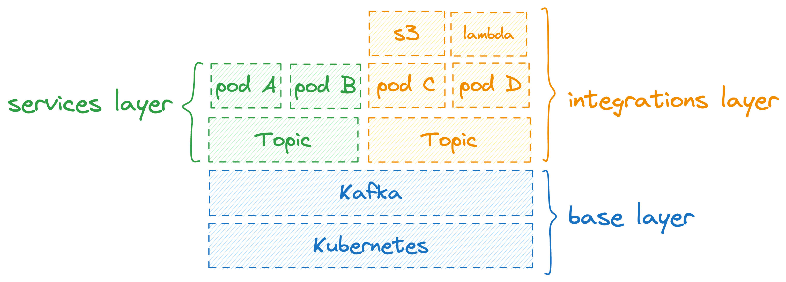
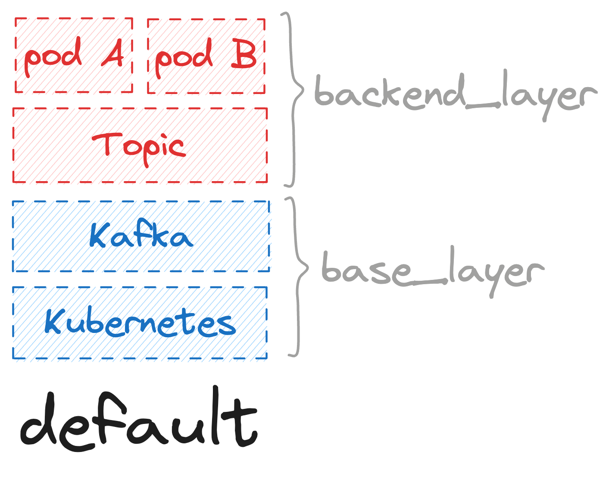
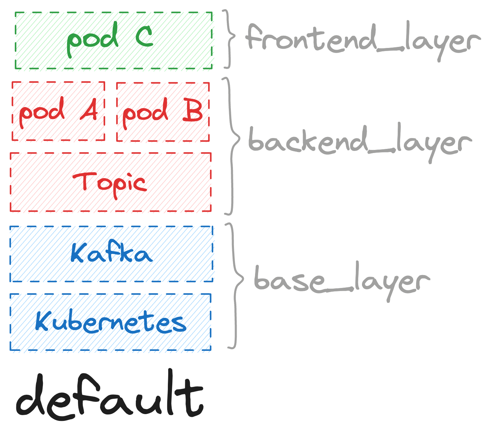
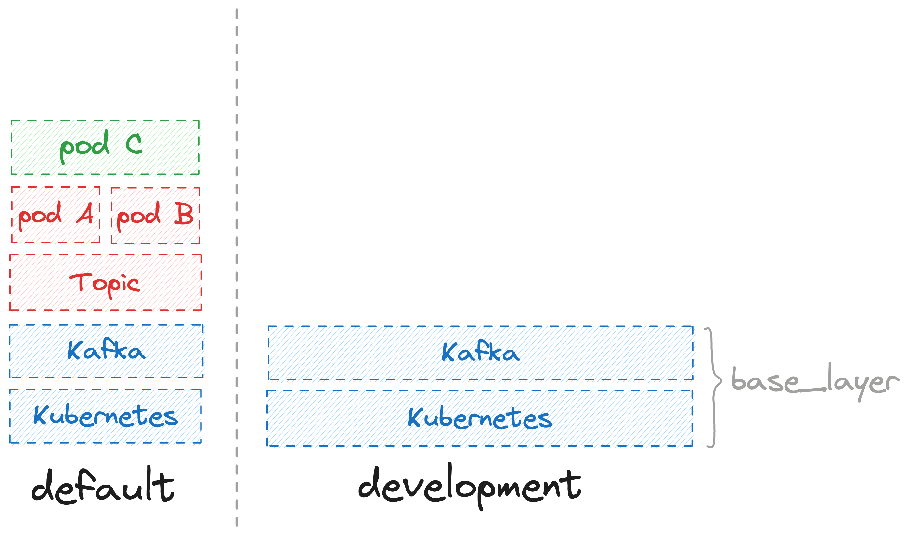
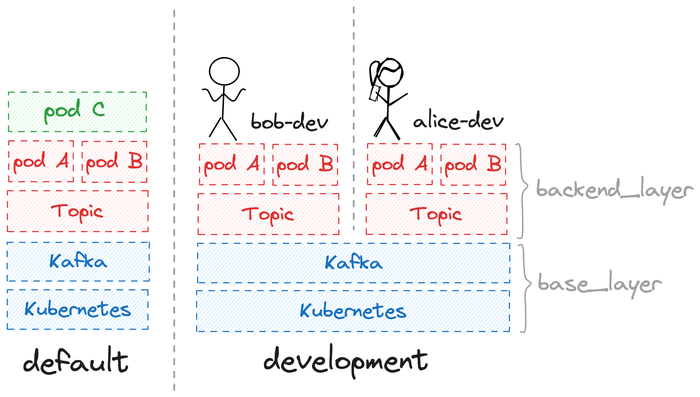

<p align="center">
  <a href="https://layerform.dev">
  <picture>
    <source width="500px" media="(prefers-color-scheme: dark)" srcset="https://github.com/ergomake/layerform/blob/main/assets/img/layerform-dark.png">
    <source width="500px" media="(prefers-color-scheme: light)" srcset="https://github.com/ergomake/layerform/blob/main/assets/img/layerform-light.png">
    
    </picture>
  </a>
</p>

<h4 align="center">
  <a href="https://docs.layerform.dev">Documentation</a> |
  <a href="https://layerform.dev">Website</a>
</h4>

<h4 align="center">
  <p>🚧 This repository is a work-in-progress.</p>
</h4>

<p align="center">
  Terraform wrapper for provisioning reusable layers of infrastructure.
</p>
<p align="center">
  <a href="https://github.com/ergomake/layerform/blob/main/LICENSE">
    
  </a>
  <a href="https://discord.gg/daGzchUGDt">
    
  </a>
  <a href="https://twitter.com/intent/follow?screen_name=GetErgomake">
    
  </a>
</p>

## What is Layerform?

Layerform makes it easy for engineers to create reusable layers of infrastructure using plain Terraform files.

When using Layerform, engineers encapsulate each part of their infrastructure into layer definitions.

```
terraform/
├── layers/
│   ├── base_layer/
│   │   ├── eks.tf
│   │   └── kafka.tf
│   ├── back_layer/
│   │   ├── topic.tf
│   │   └── services.tf
│   └── front_layer/
│       └── webapp.tf
└── main.tf
```

Then, engineers can create infrastructure by stacking each of those layers. Layerform's magic is that layers can share the same base layer, allowing for easy reuse.

Reusing layers is useful for easily creating production-like environments without necessarily having to recreate the whole infrastructure every time. With layers, users can spin up only the parts of the infrastructure they need.

<p align="center">
  
</p>

Reusing infrastructure helps teams save money by eliminating unnecessary duplication of infrastructure. Additionally, layers allow teams to provision environments more quickly because engineers can apply only the additional layers they need.

Another advantage of breaking infrastructure into layers is that organizations can define clearer boundaries between teams. Consequently, it will be easier for these organizations to [mirror their team's structure into their system's structure](https://martinfowler.com/bliki/ConwaysLaw.html).

<p align="center">
  
</p>

## Getting started

The first step to use layerform is to use the `layerform-provider` to define which files each layer contains.

```hcl
# In main.tf

terraform {
  required_providers {
    layerform = {
      source  = "ergomake/layerform"
      version = "~> 0.1"
    }
  }
}

provider "layerform" {
  backend = "local"
}

resource "layerform_layer" "base" {
  name   = "base_layer"
  files = ["./base_layer/**"]
}

resource "layerform_layer" "backend" {
  name   = "backend_layer"
  files = ["./backend/**"]
  dependencies = [
    layerform_layer.base.id
  ]
}

resource "layerform_layer" "frontend" {
  name   = "frontend_layer"
  files = ["./frontend/**"]
  dependencies = [
    layerform_layer.backend.id
  ]
}
```

After defining each layer, you can `terraform apply` them. The `layerform-provider` will then take care of creating unique IDs for each layer and sending the Terraform files' contents to the Layerform Back-end.

Once each of these layer definitions has been saved, you can use `layerform apply <layer>` to create the infrastructure corresponding to each particular layer.

For example, to create infrastructure for the `base` layer you can run `layerform apply base_layer`. That command will cause `layerform` to create infrastructure corresponding to the `base_layer` layer and group them under the `name` "`default`".

<p align="center">
  
</p>

Then, to create the `backend_layer` layer on top of the `default` base layer, run `layerform apply backend_layer`.

> Note that whenever a `--name` is not passed, the string "`default`" is used as the name for the layer instance.

<p align="center">
  
</p>

Finally, to apply the `frontend_layer` on top of the underlying `default` layers, use `layerform apply frontend_layer`.

<p align="center">
  
</p>

Alternatively, you could use `layerform apply frotend_layer` straightaway, which would cause `layerform` to recursively create _all_ the underlying layers and name them "`default`".

## Reusing infrastructure for development environments

Now, let's assume you wanted to create a whole separate environment for engineers to develop their applications against. This environmen needs to closely ressemble production, but it can't interfere with production resources like the production Kubernetes and Kafka instances.

For that, you can use `layerform apply base_layer --name=development`. This command will cause `layerform` to create brand new resources corresponding to the `base_layer`, and group them under the name `development`.

<p align="center">
  
</p>

After that, multiple back-end engineers can spin-up their application's infrastructure on top of this layer's resources. An engineer called Alice could then use `layerform apply backend_layer --x-base_layer=development --name=alice-dev` to create their infrastructure, while an engineer called Bob could use `layerform apply backend_layer --x-base_layer=development --name=bob-dev`.

<p align="center">
  
</p>

## Automatic cost attribution

By using layers, you can automatically attribute cost to the different layers of your application.

When applying layers, Layerform will automatically tag the resources it creates with the actual name assigned to the layer instance. If you have `production` and `development` base layers, for example, each of those two will contain the tag `layerform_name` with their respective names.

Then, each resource on top of those base layers will include `layerform_base_name` with its respective base layer. For example, if multiple developers are spinning up resources on top of the `development` base layer, their own resources will contain a `layerform_base_name` tag whose value is `development`.

That way, Layerform can recursively traverse layers' resources to collect cost management information. Consequently, it will be able to tell the cost of your whole `production` and `development` layers, as well as an aggregate cost report of everything on top of those layers.

## Layer immutability and layer rebasing

A layer can only mutate itself or the layers above. For example, if you have a `base_layer` and a `backend_layer`, the `backend_layer` Terraform files will _not_ be able to mutate any infrastructure in a `base_layer` instance. Still, the `base_layer` can mutate all instances of all the layers above it.

The way Layerforms prevents undesirable mutations is by analyzing each `terraform plan` and detecting whether any mutation's target belongs to an underlying layer.

The reason Layerform prevents a layer from mutating its underlying layer is to avoid breaking sibling pieces of infrastructure.

This design allows for platform teams to rebase layer instances on top of theirs. For example, assume you have multiple application layers on top of a Kubernetes cluster belonging to a `base_layer`. In that case, if the platform team wants to update the Kubernetes version and needs to patch existing application's manifests, they can do so from their own layer by using data sources.

## How Layerform works

Layerform has three major components. The `layerform-provider`, the Layerform Back-end, and Layerform CLI.

<p align="center">
  
</p>

The `layerform-provider` is used by Terraform to provision the Layerform Back-end with all the metadata for each layer, like its name and dependencies, and all the Terraform files associated with that layer.

The Layerform Back-end stores the data for each layer definition and stores the state for each instance of each layer so that new layers know which base state to use.

> There can be multiple types of back-ends. The most common types of back-end are `local`, for storing data locally, and `ergomake`, for storing data on the cloud.

Finally, the Layerform CLI talks to the Layerform Back-end to fetch the files for the layer it wants to apply, and the state for the underlying layer.

The way the Layerform CLI creates new layers on top of the correct existing layers is by injecting the underlying layer's state when applying each layer.

## Layerform design philosophy

Our main goal with Layerform was to make it as easy as possible for engineers to create and share different parts of their infrastructure. That way, we'd empower teams to create their own environments without burdening their organization with unnecessary costs or complex configuration files.

When developing Layerform, we also determined it should support virtually _any_ type of infrastructure, including infrastructure for serverless applications. That's why we decided to create a wrapper on top of Terraform, which supports Kubernetes/Helm, and already has established providers for all major public clouds.

Third, we decided Layerform should be simple and intuitive. Engineers shouldn't have to learn new proprietary languages or configuration formats to use Layerform. Whenever possible, we should allow them to reuse their existing configurations. Layerform concepts are the only thing engineers will need to learn about. Everything else should be "just Terraform".

Finally, we decided Layerform needs to be open and free. It's for that reason we're using a GPL license, and that's why you don't necessarily need to pay for anything before you can extract value from Layerform. Sure, Ergomake Cloud can make things easier and provide a bunch of interesting Governance and Management features, but those are not necessary.

## Issues & Support

You can find Layerform's users and maintainers in [GitHub Discussions](https://github.com/ergomake/layerform/discussions). There you can ask how to set up Layerform, ask us about the roadmap, and discuss any other related topics.

You can also reach us directly (and more quickly) on our [Discord server](https://discord.gg/daGzchUGDt).

## Other channels

-   [Issue Tracker](https://github.com/ergomake/layerform/issues)
-   [Twitter](https://twitter.com/GetErgomake)
-   [LinkedIn](https://www.linkedin.com/company/layerform)
-   [Ergomake Engineering Blog](https://ergomake.dev/blog)

## License

Licensed under the [GNU GPLv3 License](https://github.com/layerform/layerform/blob/main/LICENSE).
