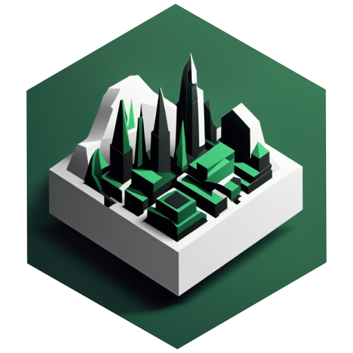
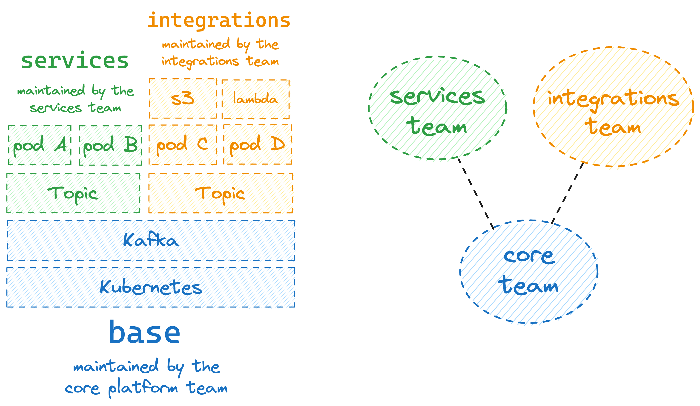
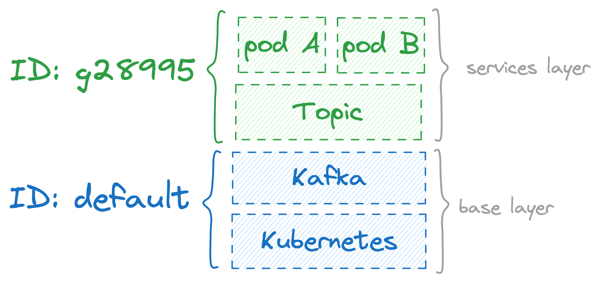
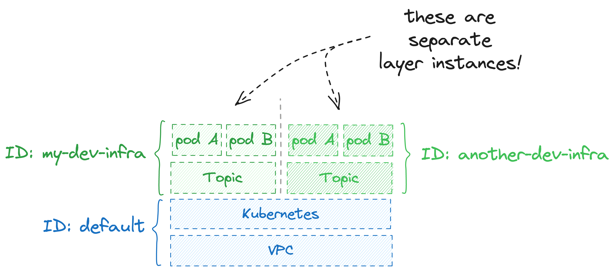
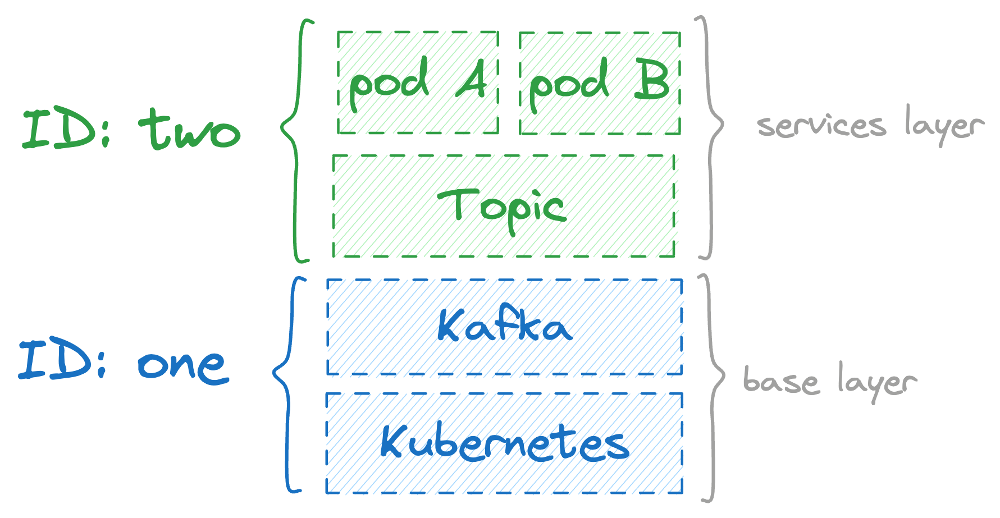
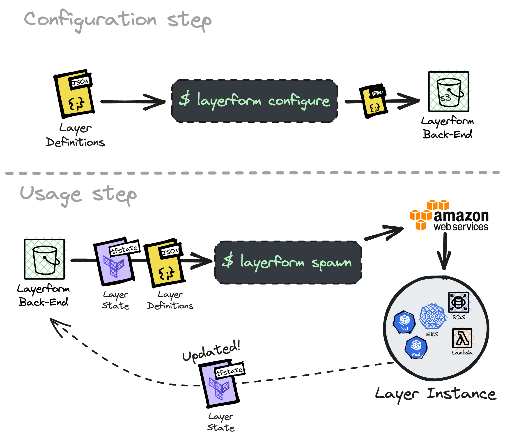

<p align="center">
  <a href="https://layerform.dev">
  <picture>
    <source width="164px" media="(prefers-color-scheme: dark)" srcset="./assets/img/logo-square.png">
    <source width="164px" media="(prefers-color-scheme: light)" srcset="./assets/img/logo-square.png">
    
    </picture>
  </a>
</p>

<h1 align="center">
  Layerform
</h1>

<p align="center">
    <strong>
        Layerform helps engineers create their own staging environments using plain Terraform files.
    </strong>
</p>

<br>

<h4 align="center">
  <a href="https://layerform.dev">Home Page</a> |
  <a href="https://docs.layerform.dev">Documentation</a> |
  <a href="https://discord.gg/daGzchUGDt">Discord</a> |
  <a href="https://docs.layerform.dev">Blog</a>
</h4>

<p align="center">
  <a href="https://github.com/ergomake/layerform/blob/main/LICENSE">
    
  </a>
  <a href="https://discord.gg/daGzchUGDt">
    
  </a>
  <a href="https://twitter.com/intent/follow?screen_name=GetErgomake">
    
  </a>
</p>

<br>

<br>

## What is Layerform?

**Layerform is a Terraform wrapper which helps engineers create their own production-like staging environment using plain Terraform files.**

To enable reuse, Layerform introduces the concept of _layers_. Each layer contains some infrastructure, and can be stacked up on top of another layer.

In addition to being much easier to use, Layerform allows teams to reuse core-pieces of infrastructure. That way, development infrastructure is much cheaper and quicker to spin up. With Layerform, Engineers only spawn the infrastructure layers they need.

<p align="center">
  
</p>

> We don't want to run your text-editor. Layerform is the standard tool for development _infrastructure_. You can keep using your text-editors, IDEs, and other local development directly on your machine.

<br>

## Why use Layerform

### Cheaper and quicker development infrastructure

Layerform is much cheaper and quicker than spinning up an entire `staging` environment for each engineer.

When using Layerform, engineers can share the same core-pieces of infrastructure, and only spin up the layers they need on top of it.

For example, if you run applications in a Kubernetes cluster, you don't have to create a brand new cluster for each engineer's environment. Instead, you can reuse the same cluster and have multiple engineers spin up their applications on top of it.

### It's just like production

Layerform's environments are just like production because they are spun up from plain Terraform files.

Whatever you can set up using a Terraform file, you can set up in a Layerform layer.

That way, **your development infrastructure will be just like production, including Lambdas, DynamoDB instances, and whatever else that you need**.

### Encapsulation / Isolation of concerns

By breaking infrastructure into layers, your organization can define clearer boundaries between teams. Consequently, it will be easier to [mirror your organization's structure into your system's structure](https://martinfowler.com/bliki/ConwaysLaw.html).

<p align="center">
  
</p>

### Cost attribution and cost savings

In addition to saving costs by reusing infrastructure, Layerform allows you to automatically track costs for each layer instance.

When applying layers, Layerform will automatically tag the resources it creates with the actual name assigned to the layer instance. If you have `production` and `development` base layers, for example, each of those two will contain the tag `layerform_name` with their respective names.

Then, each resource on top of those base layers will include `layerform_base_name` with its respective base layer. For example, if multiple developers are spinning up resources on top of the `development` base layer, their own resources will contain a `layerform_base_name` tag whose value is `development`.

That way, Layerform can recursively traverse layers' resources to collect cost management information. Consequently, it will be able to tell the cost of your whole `production` and `development` layers, as well as an aggregate cost report of everything on top of those layers.

<br>

## Getting started

The first step to use Layerform is to create the Terraform files to provision each layer of infrastructure. In the example below, we have two layers: `eks`, which is the "base" layer, and `services`.

```
layerform/
├─ services/
│ ├─ pods.tf
│ ├─ outputs.tf
│ └─ inputs.tf
├─ eks/
│ ├─ eks.tf
│ ├─ vpc.tf
│ ├─ inputs.tf
│ └─ outputs.tf
├─ services.tf
└─ eks.tf
```

Once you have your infrastructure defined as code, you'll use Terraform and the `layerform-provider` to create the layer definitions that the CLI will use when spawning instances of each layer.

```hcl
# In a Terraform file of yours, like `main.tf`

terraform {
  required_providers {
    layerform = {
      source  = "ergomake/layerform"
      version = "~> 0.1"
    }
  }
}

provider "layerform" {
  backend = "s3"
  bucket = "my-example-bucket"
}

resource "layerform_layer_definition" "base_layer" {
  name   = "base"
  files = [ "./layerform/eks.tf", "./layerform/eks/**" ]
}

resource "layerform_layer_definition" "services_layer" {
  name   = "services"
  files = [ "./layerform/services.tf", "./layerform/services/**" ]
  dependencies = [ layerform_layer_definition.base_layer.name ]
}
```

After defining each layer definition, you should `terraform apply` them.

The `layerform-provider` will then take care of creating unique IDs for each layer and sending the Terraform files' contents to the Layerform back-end, which, in this case, is an S3 bucket.

After saving these layer definitions, you can use `layerform spawn <definition_name> <desired_id>` to create an instance of that particular layer.

```
$ layerform spawn services my-dev-infra
```

Each instance of a layer contains all the pieces of infrastructure defined within that layer's files.

<p align="center">
  
</p>

In this example, running that command will cause Layerform to also create an instance of the underlying `eks` layer and assign it the ID `default`.

To spawn yet another `services` layer, just run `layerform spawn services another-dev-infra`. By default, Layerform will try to use underlying layers whose ID is `default` as base layers.

<p align="center">
  
</p>

As a general rule, underlying layers are always the ones whose ID is `default`. To specify the desired ID for each underlying layer, you'll have to use the `--base` parameter. For example:

```
# Creates:
# 1. An eks layer with ID "one"
# 2. A services layer with ID "two"

$ layerform spawn services two --base "eks=one"
```

<p align="center">
  
</p>

<br>

## Layer immutability and layer rebasing

A layer can only mutate itself or the layers above. For example, if you have a `base` layer and a `backend` layer, the `backend` layer's Terraform files will _not_ be able to mutate any infrastructure in a `base` layer instance. Still, the `base` layer files can mutate any instances of the layers above it.

The way Layerform prevents undesirable mutations is by analyzing each `terraform plan` and detecting whether any mutation's target belongs to an underlying layer.

The reason Layerform prevents a layer from mutating its underlying layer is to avoid breaking sibling pieces of infrastructure.

This design allows for platform teams to "rebase" layer instances on top of theirs. For example, assume you have multiple application layers on top of a Kubernetes cluster belonging to a `base` layer. In that case, if the platform team wants to update the Kubernetes version and needs to patch existing application's manifests, they can do so from their own layer by referencing and patching other Terraform resources.

On the other hand, product engineers on the layers above cannot modify the `base` layer containing the Kubernetes cluster. Otherwise, they could break everyone else's applications.

In addition to preventing failures, immutability defines clearer communication interfaces between teams and helps organizations avoid lots of lateral channels.

<br>

## How Layerform works

Layerform has three major components. The `layerform-provider`, the Layerform Back-end, and Layerform CLI.

<p align="center">
  
</p>

The `layerform-provider` is used by Terraform to provision the Layerform Back-end with all the metadata for each layer, like its name and dependencies, and all the Terraform files associated with that layer.

The Layerform Back-end stores the data for each layer definition and stores the state for each instance of each layer so that new layers know which base state to use.

> There can be multiple types of back-ends. The most common types of back-end are `local`, for storing data locally, and `ergomake`, for storing data on the cloud.

Finally, the Layerform CLI talks to the Layerform Back-end to fetch the files for the layer it wants to apply, and the state for the underlying layer.

The way the Layerform CLI creates new layers on top of the correct existing layers is by injecting the underlying layer's state when applying each layer.

<br>

## Layerform design philosophy

Our main goal with Layerform was to make it as easy as possible for engineers to create and share different parts of their infrastructure. That way, we'd empower teams to create their own environments without burdening their organization with unnecessary costs or complex configuration files.

When developing Layerform, we also determined it should support virtually _any_ type of infrastructure, including infrastructure for serverless applications. That's why we decided to create a wrapper on top of Terraform, which supports Kubernetes/Helm, and already has established providers for all major public clouds.

Third, we decided Layerform should be simple and intuitive. Engineers shouldn't have to learn new proprietary languages or configuration formats to use Layerform. Whenever possible, we should allow them to reuse their existing configurations. Layerform concepts are the only thing engineers will need to learn about. Everything else should be "just Terraform".

Finally, we decided Layerform needs to be open and free. It's for that reason we're using a GPL license, and that's why you don't necessarily need to pay for anything before you can extract value from Layerform.

For the sake of transparency, the way we intend to make money in the future is by providing a managed service with governance, management, and cost-control features.

<br>

## Issues & Support

You can find Layerform's users and maintainers in [GitHub Discussions](https://github.com/ergomake/layerform/discussions). There you can ask how to set up Layerform, ask us about the roadmap, and discuss any other related topics.

You can also reach us directly (and more quickly) on our [Discord server](https://discord.gg/daGzchUGDt).

<br>

## Other channels

-   [Issue Tracker](https://github.com/ergomake/layerform/issues)
-   [Twitter](https://twitter.com/GetErgomake)
-   [LinkedIn](https://www.linkedin.com/company/layerform)
-   [Ergomake Engineering Blog](https://ergomake.dev/blog)

<br>

## License

Layerform is _truly_ open-source.

Licensed under the [GNU GPLv3 License](https://github.com/layerform/layerform/blob/main/LICENSE).


