# Breaking Terraform files into composable layers

Terraform allows you to spin up cloud infrastructure using a single command. Let's say you're trying to run Elasticsearch and Kibana within a Kubernetes cluster, for example.

For that, you could write a few `.tf` files and run `terraform apply` to provision a Kubernetes cluster and deploy a few pods to it.

<br />
<p align="center">
  <picture>
    <source width="250px" media="(prefers-color-scheme: dark)" srcset="./img/breaking-terraform-into-layers/single-cluster-dark.png">
    <source width="250px" media="(prefers-color-scheme: light)" srcset="./img/breaking-terraform-into-layers/single-cluster.png">
    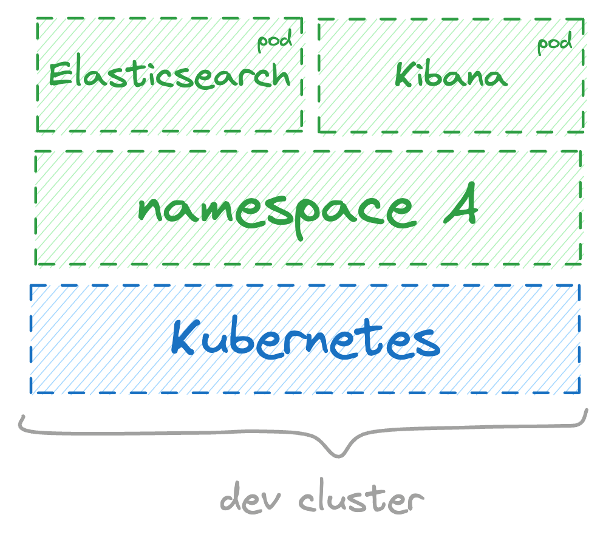
  </picture>
</p>
<br />

Now, assume you want other instances of the Elastic stack that you can use for demos. In that case, you'll have to set up brand new [Terraform workspaces](https://developer.hashicorp.com/terraform/language/state/workspaces) and run `terraform apply` multiple times.

The problem with this approach is that it will cause you to replicate your _entire_ infrastructure every time. Consequently, you'll have multiple Kubernetes clusters. Each cluster takes at least 15 minutes to spin up and costs $72 a month on AWS.

<br />
<p align="center">
  <picture>
    <source width="800px" media="(prefers-color-scheme: dark)" srcset="./img/breaking-terraform-into-layers/multi-cluster-dark.png">
    <source width="800px" media="(prefers-color-scheme: light)" srcset="./img/breaking-terraform-into-layers/multi-cluster.png">
    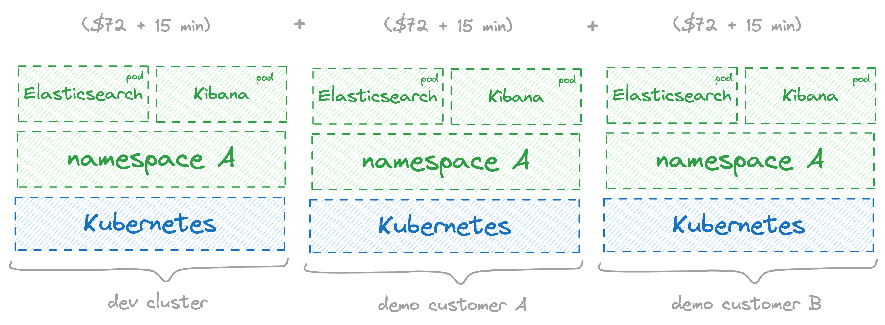
  </picture>
</p>
<br />

A much better alternative would be to reuse a single Kubernetes cluster and spin up multiple environments on top of it. Thus, you'd pay for a single cluster, and you don't have to wait for a brand new cluster every time you spawn a new environment.

<br />
<p align="center">
  <picture>
    <source width="900px" media="(prefers-color-scheme: dark)" srcset="./img/breaking-terraform-into-layers/multi-layers-dark.png">
    <source width="900px" media="(prefers-color-scheme: light)" srcset="./img/breaking-terraform-into-layers/multi-layers.png">
    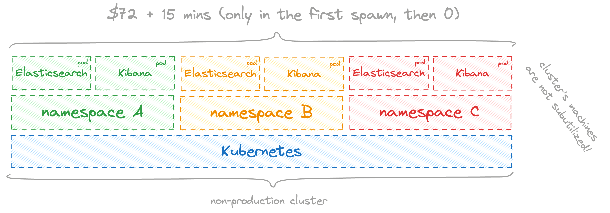
  </picture>
</p>
<br />

That's why [Layerform](https://github.com/ergomake/layerform) exists. Layerform allows engineers to break their Terraform files into composable _layers_. That way, teams can have a shared base layer for their Kubernetes cluster and multiple top layers with Elasticsearch, Kibana, and even other serverless components they need, like Lambdas, SQS queues, or load balancers.

<br />
<p align="center">
  <picture>
    <source width="400px" media="(prefers-color-scheme: dark)" srcset="./img/breaking-terraform-into-layers/serverless-layers-dark.png">
    <source width="400px" media="(prefers-color-scheme: light)" srcset="./img/breaking-terraform-into-layers/serverless-layers.png">
    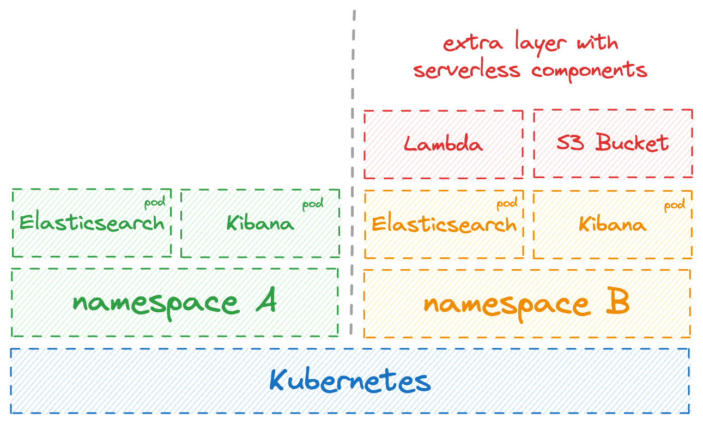
  </picture>
</p>
<br />

In this post, I'll explain how layers work, how to break your Terraform files into composable layers and demonstrate a few use cases that layers enable. Those use cases include creating production-like development environments and setting up pull request preview links for _any_ type of application.

> As a note, Terraform workspaces are quite laborious to use. The official documentation even contains a warning about using them.
> _**Important**: Workspaces are not appropriate for system decomposition or deployments requiring separate credentials and access controls._

<br />

## How layers work

In Layerform, Terraform files are divided into layers. Each layer definition specifies the files that belong to it and a list of dependencies.

Let's say you're trying to run Elasticsearch and Kibana within an EKS instance (AWS-managed k8s).

For that, you'd have two layers, one for `eks`, and another for the `elastic_stack`.

```json
{
    "layers": [
        {
            "name": "eks",
            "files": ["layers/eks.tf", "layers/eks/**"]
        },
        {
            "name": "elastic_stack",
            "files": ["layers/elastic_stack.tf", "layers/elastic_stack/**"],
            "dependencies": ["eks"]
        }
    ]
}
```

In the `eks` layer definition, you specify which files belong to that layer. Given that `eks` does _not_ depend on any other infrastructure, it won't list any other layers as dependencies. On the other hand, the `elastic_stack` layer's files depend on `eks`. Consequently, it will include `eks` as a dependency.

After defining layers this way, you can spin up an EKS cluster independently by running `layerform spawn eks default`.

<br />
<p align="center">
  <picture>
    <source width="250px" media="(prefers-color-scheme: dark)" srcset="./img/breaking-terraform-into-layers/single-layer-dark.png">
    <source width="250px" media="(prefers-color-scheme: light)" srcset="./img/breaking-terraform-into-layers/single-layer.png">
    
  </picture>
</p>
<br />

Then, each engineer can create their own instances of the `elastic_stack` and reuse the same cluster. For that, they'd all run `layerform spawn elastic_stack <name>`, and each of these layers would look for an underlying `eks` layer with ID `default`.

<br />
<p align="center">
  <picture>
    <source width="400px" media="(prefers-color-scheme: dark)" srcset="./img/breaking-terraform-into-layers/multi-devs-dark.png">
    <source width="400px" media="(prefers-color-scheme: light)" srcset="./img/breaking-terraform-into-layers/multi-devs.png">
    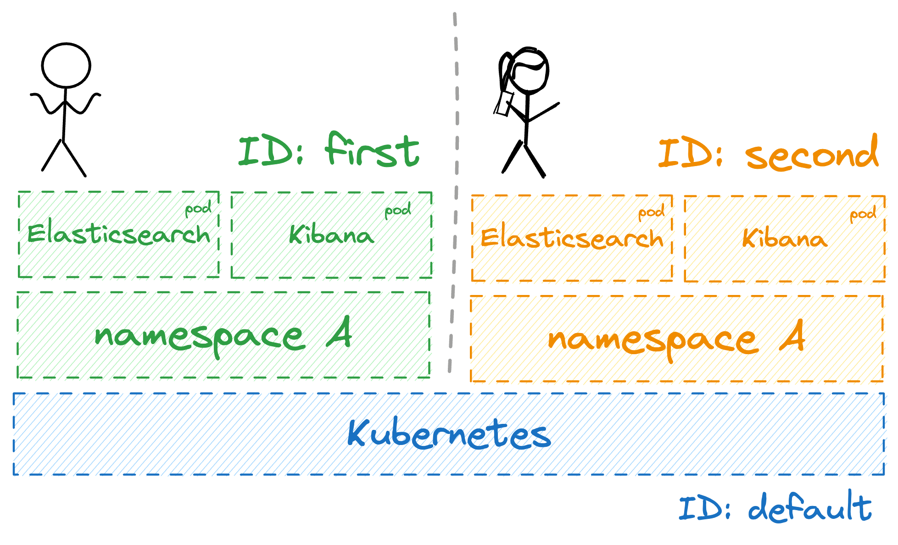
  </picture>
</p>
<br />

```
➜ layerform list instances
INSTANCE NAME                LAYER NAME    DEPENDENCIES
default                      eks
first                        elastic_stack  eks=default
second                       elastic_stack  eks=default
```

If someone needs a new cluster, they can recreate the whole stack by passing the `--base` flag, as in `layerform spawn elastic_stack third --base eks=another_eks`.

<br />
<p align="center">
  <picture>
    <source width="600px" media="(prefers-color-scheme: dark)" srcset="./img/breaking-terraform-into-layers/multi-stack-dark.png">
    <source width="600px" media="(prefers-color-scheme: light)" srcset="./img/breaking-terraform-into-layers/multi-stack.png">
    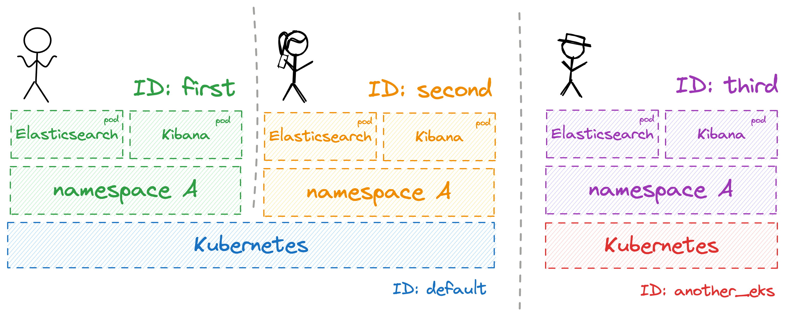
  </picture>
</p>
<br />

```
➜ layerform list instances
INSTANCE NAME                LAYER NAME    DEPENDENCIES
default                      eks
another_eks                  eks
first                        elastic_stack  eks=default
second                       elastic_stack  eks=default
third                        elastic_stack  eks=another_eks
```

When done with their layers, engineers can kill their layer instances without damaging someone else's work.

<br />
<p align="center">
  <picture>
    <source width="600px" media="(prefers-color-scheme: dark)" srcset="./img/breaking-terraform-into-layers/layerform-kill-dark.png">
    <source width="600px" media="(prefers-color-scheme: light)" srcset="./img/breaking-terraform-into-layers/layerform-kill.png">
    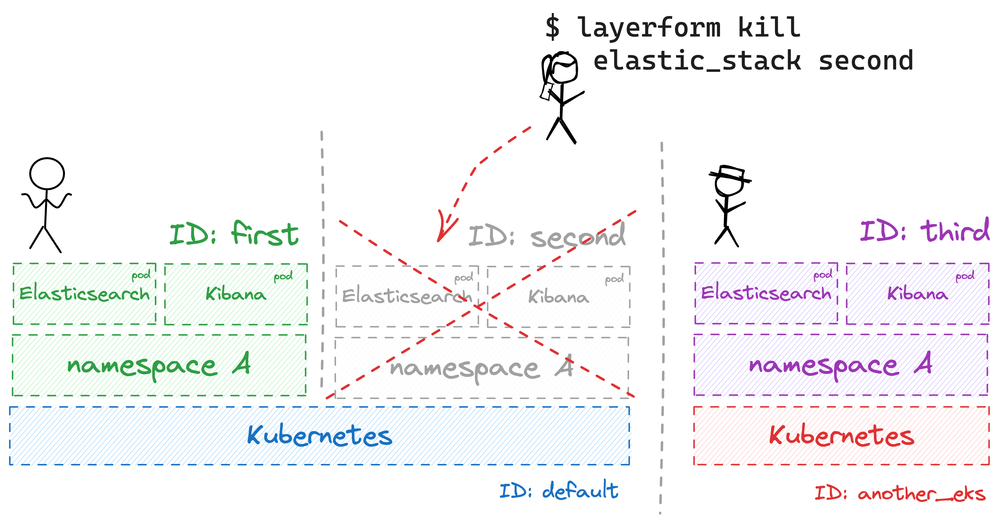
  </picture>
</p>
<br />

In a way, Layerform's layers are similar to container layers. Some people refer to them as "Kustomize for Terraform."

<br />

## Using layers to create development environments

For most teams, "staging" is a bottleneck. Usually, companies have many engineers, but there's only a single "staging" environment for everyone to use. Consequently, developers wanting to test changes in a production-like environment must queue.

Additionally, when systems are large or depend on serverless components, engineers cannot reliably run all their software on their machines. Therefore, they all point to the same staging environment and step on each others' toes.

<br />
<p align="center">
  <picture>
    <source width="600px" media="(prefers-color-scheme: dark)" srcset="./img/breaking-terraform-into-layers/bottleneck-dark.png">
    <source width="600px" media="(prefers-color-scheme: light)" srcset="./img/breaking-terraform-into-layers/bottleneck.png">
    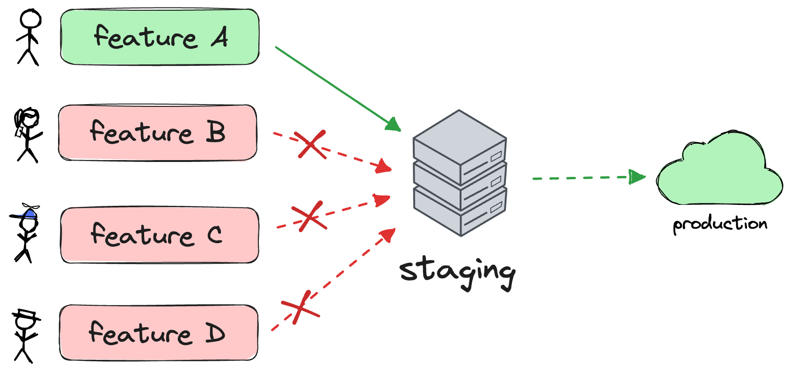
  </picture>
</p>
<br />

Layers help teams solve this problem by enabling each engineer to spin up their own environment and share core pieces of infrastructure, as shown earlier.

<br />
<p align="center">
  <picture>
    <source width="600px" media="(prefers-color-scheme: dark)" srcset="./img/breaking-terraform-into-layers/no-bottleneck-dark.png">
    <source width="600px" media="(prefers-color-scheme: light)" srcset="./img/breaking-terraform-into-layers/no-bottleneck.png">
    
  </picture>
</p>
<br />

Layerform also provides developers valuable features to develop applications locally while pointing them to their own "staging" environment's back-end.

Assume you cannot run Elasticsearch locally because the JVM needs too much memory, for example. In that case, you could use `layerform output` to get the address of your remote Elasticsearch instance.

```
➜ layerform output elastic_stack first

{
  "cluster_name": {
    "sensitive": false,
    "type": "string",
    "value": "demo-eks-post-example"
  },
  "elasticsearch_url": {
    "sensitive": false,
    "type": "string",
    "value": "https://elasticsearch-post-example.environment.ergomake.link"
  }
}
```

You could use that URL in your Kibana configuration file (`config.yml`). That way, you could point your local Kibana to the remote Elasticsearch as you develop.

```yml
elasticsearch.hosts:
    ["https://elasticsearch-post-example.environment.ergomake.link"]
```

In case you had multiple outputs you need to interpolate in your configuration file, as many applications have, you could even write a template file and tell Layerform to interpolate it for you.

Take the following template file for Kibana's `config.yml`, for example.

```yml
elasticsearch.hosts: ["{{elasticsearch_url.value}}"]
```

To render that file and replace `{{ elasticsearch_url.value }}` with the actual values for your particular layer, you could use the `--template` flag to output the rendered file to `stdout`.

```yml
➜ layerform output elastic_stack first --template config/kibana-template.yml

elasticsearch.hosts: ['http://elastic-stack-xehl-es.environment.ergomake.link']
```

Engineers could then pipe the rendered file to an actual `config.yml` and use it without knowing anything about layers or manually entering values.

```yml
➜ layerform output elastic_stack first --template config/kibana-template.yml > config.yml
```

After that, `yarn start` would cause Kibana to read `config.yml` and point to the remote Elasticsearch.

<br />

### A note on collaborating with layers

Similarly to Terraform, Layerform may use a remote back-end to store states and layer definitions.

Once an engineer creates a layer instance, Layerform syncs it with a remote state file in S3. Then, when someone else uses `layerform list instances`, Layerform will fetch states from the remote back-end and list an up-to-date list of instances.

<br />
<p align="center">
  <picture>
    <source width="600px" media="(prefers-color-scheme: dark)" srcset="./img/breaking-terraform-into-layers/remote-list-dark.png">
    <source width="600px" media="(prefers-color-scheme: light)" srcset="./img/breaking-terraform-into-layers/remote-list.png">
    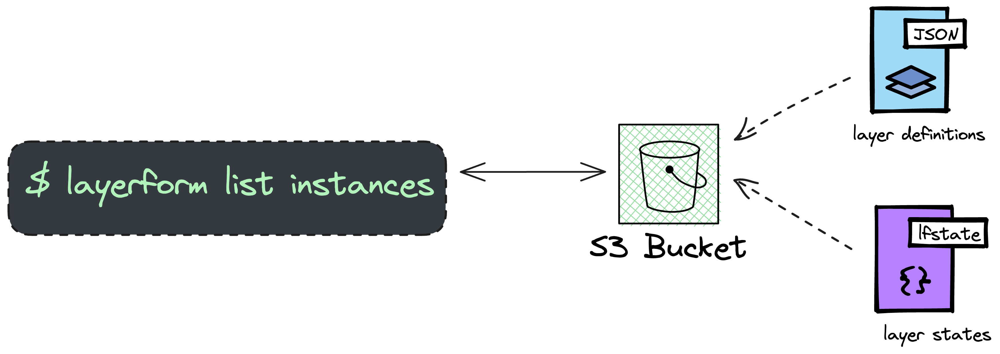
  </picture>
</p>
<br />

Assume engineer A spun up layer `first`. If engineer B wants to collaborate with engineer A, they will be able to see `first` in the list of layers because the list is stored remotely.

```
# Ran by engineer B
➜ layerform list instances

INSTANCE NAME                LAYER NAME     DEPENDENCIES
default                      eks
first                        elastic_stack  eks=default
```

Then, engineer B can also get the URL of the Elasticsearch instance in layer `first` by running `layerform output`.

> We're still working on proper locking and collaboration mechanisms to keep states free of race conditions. We welcome pull requests for that in case you're interested in contributing.

<br />

## Using layers to create pull request previews

Whenever engineers make changes and open a pull request, Vercel spins up their Next.js application and adds a preview link to the PR.

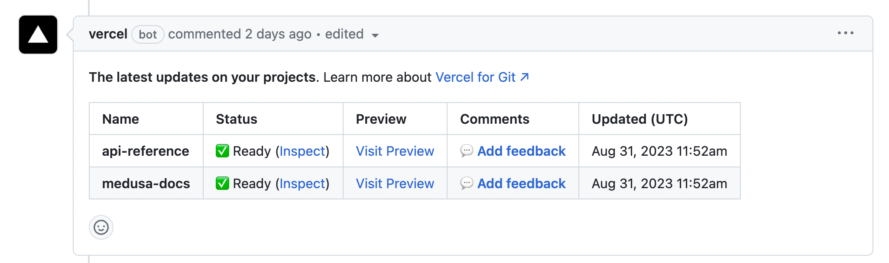

Most developers, designers, and product managers love Vercel's previews. **The problem is that these previews do not work for teams with more complex set-ups**. For example, you can't get full-stack previews if you have a serverless application or need a Kubernetes cluster.

Today, most teams end up building these preview environments in-house, using a bunch of ad-hoc scripts.

[Layerform](https://github.com/ergomake/layerform) helps teams solve this problem by allowing them to create a separate preview layer. Then, engineers can call the Layerform CLI from their CI and spin up only the infrastructure they need.

Since Layerform uses Terraform files, it can spin up all types of infrastructure for these previews, including Kubernetes resources, Lambdas, SQS instances, and S3 buckets.

In the case of the Elastic stack, for example, engineers could create a GitHub action to `layerform spawn` only the Elastic stack layer on top of a shared `preview` cluster, making previews much less expensive.

```yaml
name: Preview

on:
    pull_request:

jobs:
    preview:
        runs-on: ubuntu-latest

        steps:
            # + Checkout code, install deps, etc...
            - name: Install Layerform
              run: go install github.com/ergomake/layerform@main

            # Configure remote state — we'll improve this
            - name: Create Layerform config file
              run: |
                  mkdir -p ~/.layerform
                  echo "currentContext: demo" > ~/.layerform/config
                  echo "contexts:" >> ~/.layerform/config
                  echo "  demo:" >> ~/.layerform/config
                  echo "    type: s3" >> ~/.layerform/config
                  echo "    bucket: layerform-post-demo" >> ~/.layerform/config
                  echo "    region: us-west-1" >> ~/.layerform/config

            # Actually spawn the preview layer
            - id: layerform
              name: Spawn Elasticstack using Layerform
              run: |
                  layerform spawn elastic_stack ${{ github.event.pull_request.head.ref }}
              env:
                  AWS_ACCESS_KEY_ID: ${{ secrets.AWS_ACCESS_KEY_ID }}
                  AWS_SECRET_ACCESS_KEY: ${{ secrets.AWS_SECRET_ACCESS_KEY }}
```

The workflow above will use the pull request's branch name as the layer instance's name.

> Just like any other layer instance, it will appear when running `layerform list`, so you can connect to it from your terminal too, if you want.

Finally, once the `spawn` is done, you can write some code to call `layerform output` and add a comment with a preview link to the pull request.

```yaml
# ...

# Get Kibana's URL from layerform output using jq
- id: layerform
  name: Spawn Elasticstack using Layerform
  run: |
      layerform spawn elastic_stack ${{ github.event.pull_request.head.ref }}
      kibana=$(layerform output elastic_stack ${{ github.event.pull_request.head.ref }} | jq -r .kibana_url.value)
      echo "kibana=$kibana" >> "$GITHUB_OUTPUT"
  env:
      AWS_ACCESS_KEY_ID: ${{ secrets.AWS_ACCESS_KEY_ID }}
      AWS_SECRET_ACCESS_KEY: ${{ secrets.AWS_SECRET_ACCESS_KEY }}

# Add a comment to the pull request
- uses: actions/github-script@v6
  with:
      script: |
          github.rest.issues.createComment({
            issue_number: context.issue.number,
            owner: context.repo.owner,
            repo: context.repo.repo,
            body: '${{ steps.layerform.outputs.kibana }}'
          })
```

After that change, you'll see a preview link pointing to actual production-like infrastructure in every PR you open.

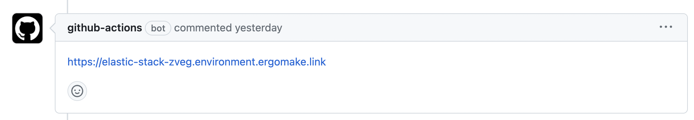

To destroy these layer instances, you should create a second workflow that's triggered when someone closes or merges a PR. That workflow should call `layerform kill` and pass it the layer's name, which, in this case, is the same as the branch's.

```yaml
name: Destroy previews when PRs are closed

on:
    pull_request:
        types: [closed]

jobs:
    kill_preview:
        runs-on: ubuntu-latest
        steps:
            # + Checkout code, install deps, etc...
            - name: Install Layerform
              run: go install github.com/ergomake/layerform@main

            - name: Kill preview
              run: layerform kill elastic_stack ${{ github.event.pull_request.head.ref }}
```

## Extra implementation notes

In these examples, I assume that users have deployed an [`nginx-ingress-controller`](https://docs.nginx.com/nginx-ingress-controller/) to their cluster through the `eks` layer. This controller is responsible for creating an `nlb` and exposing Elasticsearch and Kibana to the internet through their ingresses.

In any case, many developers would probably want to keep their development environments within a VPN, which is also possible because Layerform provisions all the infrastructure in _your_ cloud using plain Terraform files.

When it comes to deploying the actual pods to your cluster, you can use whatever you want. When I tested the examples myself, I specified raw Kubernetes resources through the `kubernetes` provider. Still, you could use Helm charts with the Helm provider. The only requirement for using layers is that your infra is in a Terraform file, not ad-hoc scripts.

Finally, another interesting detail is that engineers must provide layer definitions to the remote back-end with `layerform configure` before anyone can spawn instances.

**If you've found this idea intriguing, please consider [giving us a star on GitHub](https://github.com/ergomake/layerform).**
