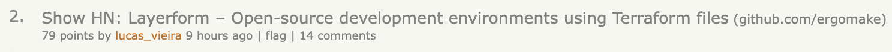
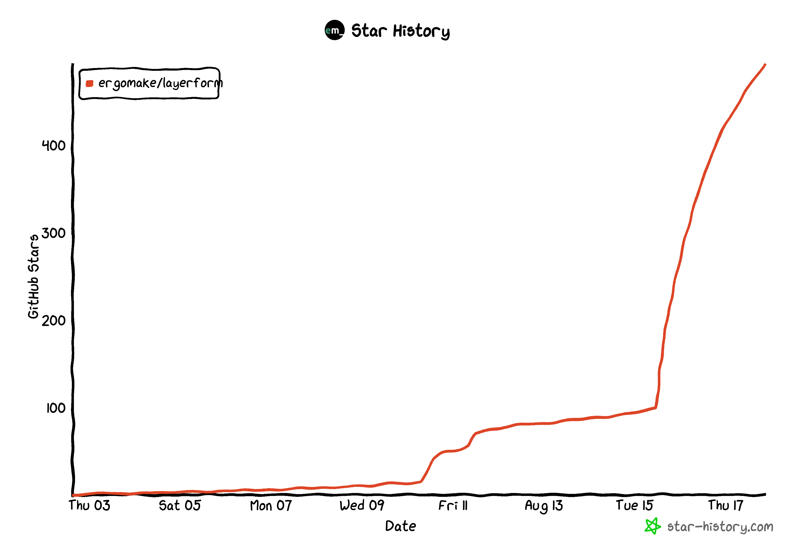

# How to do a successful Hacker News launch

The #1 question I get asked by batchmates is how I get so many HN front pages with [my blog](https://lucasfcosta.com).

This week, Layerform got to the front page for the first time too, and I got asked that question another bunch of times.

I decided to write this document explaining how to do it so I can send people a link now.

As a heads-up, there is only _one_ hack: making something people want (to upvote).

Also, keep in mind [this is all public information on how HackerNews works](https://github.com/minimaxir/hacker-news-undocumented). There's no magic here.

1. **Make your title direct and specific.** Get straight to the point. Generic or vague titles do not perform well. Salesy titles perform even worse. Don't worry about adding some technical detail. Explain what you do precisely.
    - Good example: `Show HN: Layerform – Open-source development environments using Terraform files`
    - Bad example: `Show HN: Layerform — A staging environment for each engineer`
    - Good example: `Show HN: PromptTools – open-source tools for evaluating LLMs and vector DBs`
    - Bad example: `Show HN: PromptTools — improve your model's responses in less time`
2. **Don't use marketing-speak.** Keep in mind that you're writing for a highly technical audience. These people can see right through your marketing-speak. You _never_ sell to developers. The only way to get developers to use your product is to build something they want and stay in front of them long enough until they need you.
3. **Use your repo, not your landing page**. For technical products, your `README` is as important as your landing page. In fact, your repo _is_ the landing page, by definition. Besides being much more helpful than a landing page, repos are more likely to lead to more stars, which then generate a network effect as GitHub broadcasts users' stars to people's followers.
4. **Use images**. Posts with images tend to perform better. That happens because people will scroll through your post before deciding whether to read it. Having images makes them more likely to decide to read and, consequently, upvote.
   I learned that images help with written content when writing [my first book](https://www.manning.com/books/testing-javascript-applications). At the time, my publisher told me that books with images tend to sell more. That's because people flip through the pages to assess the quality of a book, and good diagrams are highly correlated with perceived quality.
5. **Add the _"Show HN:"_ prefix whenever launching something**. Using this prefix will cause you to appear on the "show" tab, which isn't _as_ competitive. You'll be able to gather upvotes for longer because fewer posts get to the "show" tab. Once you're on the front page, you can expect to remain there for a while. If you're curious why, read [this page on HN's gravity algorithm](http://www.righto.com/2013/11/how-hacker-news-ranking-really-works.html).
6. **Cut unnecessary words**. Eliminate clutter. After writing, re-read your text and make it shorter. You'll be surprised by how much shorter it gets if you cross out unnecessary words. My drafts usually get 30% shorter when I do that. The reason those posts perform better is not because they're short but because they're direct. Absolute length doesn't matter.
7. **Tell a story**. Stories are easier to follow and perform better. I don't mean you should write fiction. Instead, you should create a logical sequence of facts. Whenever possible, use concrete examples before going into abstract facts.
8. **Do not ask for upvotes**. HN's algorithms for detecting voting rings are excellent. It won't work, trust me. Also, don't ever send the direct link to the post for someone else to upvote. Those upvotes won't count.
9. **There's no best time to post**. It's always a tradeoff of how many eyeballs you'll get on your post vs. how easy it is to get to the front page. Also, the ratio of eyeballs upvoting vs. new posts tends to be roughly the same, which means it's always difficult to get to the front page anyway.
10. **Engage with the post's comments**. One of the main benefits of being in front of the HN audience is their feedback. They're experienced and don't hold back on sharing harsh feedback, which you need as a founder.
