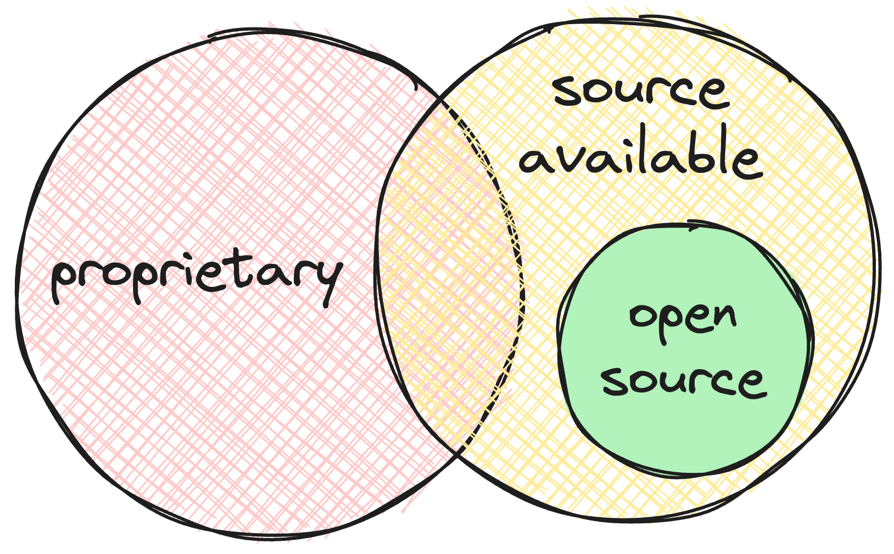

# Open-source washing

There are only two categories of software: open-source software and proprietary software. Any software that's not open-source is proprietary, regardless of whether its source code is available on GitHub.

 

  <picture>
    <source width="400px" media="(prefers-color-scheme: dark)" srcset="./img/source-available-is-not-open-source/open-source-dark.png">
    <source width="400px" media="(prefers-color-scheme: light)" srcset="./img/source-available-is-not-open-source/open-source.png">
    
  </picture>

 

When companies or individuals try to misconstrue proprietary software as open source, I call that _open source washing_.

In this post, I'll elucidate the differences between open source and proprietary source available software and explain why "open source washing" is harmful.

## What is open-source software, and why does it matter?

By definition, open source software is any software whose license belongs to [the list of licenses approved by the Open Source Initiative (OSI)](https://opensource.org/licenses/). Any software whose license is not on that list is proprietary software.

There's no room for arguing, and there's no in-between — any software whose license doesn't belong to the OSI's list is proprietary software.

These definitions are important because open-source software has relevant attributes to its users and developers.

All licenses on this list are guaranteed to adhere to [a fixed set of criteria](https://opensource.org/osd/). These criteria guarantee [four essential freedoms](https://www.gnu.org/philosophy/free-sw.en.html):

1. Users can run the program however they wish, for any purpose
2. Users are free to modify the program
3. Users are free to redistribute the program
4. Users are free to redistribute modified copies of the program

These freedoms are not necessarily "good" or desirable. Still, they create legal certainty for the users of open-source software.

These freedoms ensure that engineers can use and build upon other software without spending money to hire legal counsel.

In other words, OSI-approved licenses provide legal certainty and allow people to meet their needs and innovate.

Licenses that don't belong to the OSI's list make software riskier to adopt unless users are willing to spend money with lawyers or incur the risk of litigation.

Take the BSL license, for example. The BSL license states that:

> The Licensor hereby grants you the right to copy, modify, create derivative works, redistribute, and make non-production use of the Licensed Work. The Licensor may make an Additional Use Grant, above, permitting limited production use.

The BSL license is _not_ an Open Source license because it restricts users' freedom to run the program however they wish. By introducing a restriction, the BSL license creates uncertainty, especially when it uses vague terms like "non-production use."

An _"Additional Use Grant"_ makes matters even worse. For example, when restricting users from embedding the software in "competitive offerings," what gets interpreted as "competitive"?

Open-source licenses don't have any of these problems because they are _always_ guaranteed to provide users with the four freedoms mentioned above.

Notice I'm not making any subjective claims here. I'm simply stating facts.

Whenever people point out that software is only open-source if its license appears in the OSI list, they do so not to be pedantic but because they recognize it's essential to have a governing body to create legal certainty.

## Source-available is not necessarily open source

To provide its users with the four essential freedoms, a program _must_ have its source code available. However, not all programs whose source is open provide their users with these freedoms.

For example, an author can publish their program's source on GitHub under a license that disallows anyone from running or modifying it. Such software is said to be "source-available" software but _not_ open-source software.

For example, saying Meta's LLaMa is an "open source" model is a misnomer. Even though one can see [the whole source on GitHub](https://github.com/facebookresearch/llama), they cannot use the model in any way they want, as stated by [the `LLAMA 2 COMMUNITY LICENSE AGREEMENT`](https://github.com/facebookresearch/llama/blob/1a240688810f8036049e8da36b073f63d2ac552c/LICENSE).

> 2. Additional Commercial Terms. If, on the Llama 2 version release date, the monthly active users of the products or services made available by or for Licensee, or Licensee's affiliates, is greater than 700 million monthly active users in the preceding calendar month, you must request a license from Meta, which Meta may grant to you in its sole discretion, and you are not authorized to exercise any of the rights under this Agreement unless or until Meta otherwise expressly grants you such rights.

As mentioned earlier, even though these licenses allow users to inspect the code, they don't necessarily allow them to run or modify the program however they want. Consequently, they create uncertainty and extra-legal burdens.

## The problem with open-source washing

It has become increasingly common for companies to say they're "open" or "committed to open source" when, in fact, they're just committing to keeping their source code available on GitHub. Effectively, their software is still proprietary.

**There's absolutely no problem with proprietary software. Software can be proprietary and still be great.**

The problem with open-source washing is that it stretches the definition of _open-source_ to the point it becomes effectively meaningless.

Open source software's _raison d'être_ is to eliminate confusion and create legal certainty. Open-source washing causes the opposite effect. It damages the original intent of the OSI's list: making a clear distinction between which pieces software users can freely run and modify and which they can't.

## Open source is not a guarantee of a business model

The whole point of copyright and licensing is to provide a legal framework to make information goods tradeable by restricting the number of available copies of the copyrighted work.

Allowing others to modify and distribute a piece of software freely makes its supply unlimited. Consequently, in a competitive market, the price of the software itself will usually converge to _zero_.

In other words, open source does not guarantee a business model. If anything, it makes it slightly more difficult for companies to create a sustainable one.

It seems to me that many companies ignored this fact when open-sourcing their products and are now trying to undo past mistakes.

Plenty of viable business models can be built on top of open source. In any case, all these models require careful consideration about which pieces of software will be made open-source and which services will be offered on top of the open-source offering.

## Notes

-   Open source software doesn't always need to be free as in free-of-charge. A piece of software can be open-source but not free-of-charge.
-   I find "open-core" to also be an imprecise term. Software is either open-source or proprietary. When people refer to "open-core" software, they usually refer to proprietary software that depends on other open-source programs.
    Again, there's nothing wrong with making "open-core" software, but perhaps we should call it proprietary software built upon open-source software.
    No one says iOS is "open core," for example. iOS is still proprietary software, even though many of the libraries it uses are open-source.
