# Manipulating Terraform states for fun, profit, and reusability

[Layerform](https://github.com/ergomake/layerform) allows developers to spin up multiple instances of their applications while reusing core parts of their infrastructure.

Assume you're running multiple pods in a Kubernetes cluster, for example. In that case, you can use Layerform so that each developer has their own pods and namespaces on top of a shared Kubernetes cluster.

<p align="center">
  <picture>
    <source media="(prefers-color-scheme: dark)" srcset="./img/terraform-states/shared-cluster-dark.png">
    <source media="(prefers-color-scheme: light)" srcset="terraform-states/shared-cluster.png">
    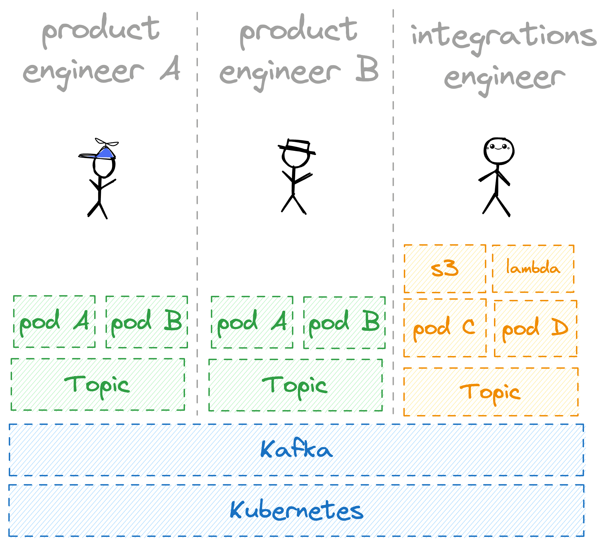
  </picture>
</p>

In this post, I'll explain how Layerform allows engineers to do that by manipulating Terraform state.

First, I'll explain how Terraform states work and the problems with how they're currently implemented. Then, I'll explain how you could manipulate states to create resource replicas and reuse infrastructure. Finally, I'll show how Layerform itself uses similar state management techniques to enable development platforms that allow for resources to be reused.

## What is a Terraform state?

Every Terraform setup has two parts: `.tf` files describing the _ideal_ state and `.tfstate` files describing the current state.

Whenever you call `terraform apply`, it will compare the desired state described in your `.tf` files with the current state in your `.tfstate` files. Then, it will apply the differences.

<p align="center">
  <picture>
    <source media="(prefers-color-scheme: dark)" srcset="./img/terraform-states/terraform-state-and-declaration-dark.png">
    <source media="(prefers-color-scheme: light)" srcset="./img/terraform-states/terraform-state-and-declaration.png">
    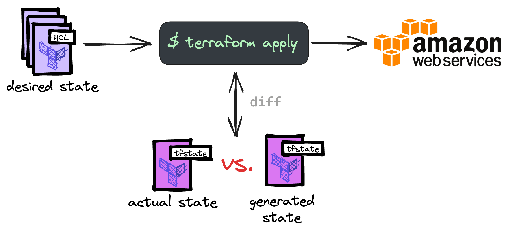
  </picture>
</p>

Assume you want to create an S3 bucket in your AWS account. For that, you'll declare the _desired_ state in your `main.tf` file.

```hcl
# main.tf

provider "aws" {
  region = "us-east-1"
}

resource "aws_s3_bucket" "my_bucket" {
  bucket = "my-unique-bucket-name-layerform"

  tags = {
    Name        = "foo"
  }
}
```

Then, when running `terraform apply`, Terraform will invoke the AWS provider, which uses the [AWS CLI](https://aws.amazon.com/cli/) to talk to AWS and create your bucket.

<p align="center">
  <picture>
    <source media="(prefers-color-scheme: dark)" srcset="./img/terraform-states/terraform-bucket-dark.png">
    <source media="(prefers-color-scheme: light)" srcset="./img/terraform-states/terraform-bucket.png">
    
  </picture>
</p>

After creating your bucket, Terraform will store information about the new bucket in a `terraform.tfstate` file. That file contains the _actual_ state of your infrastructure.

```jsonc
{
  "version": 4,
  "terraform_version": "1.5.5",
  "serial": 1,
  "lineage": "ca8081999999999999999999999999999999",
  "outputs": {},
  "resources": [
    {
      "mode": "managed",
      "type": "aws_s3_bucket",
      "name": "my_bucket",
      "provider": "provider[\"registry.terraform.io/hashicorp/aws\"]",
      "instances": [
        {
          "schema_version": 0,
          "attributes": {
            "arn": "arn:aws:s3:::my-unique-bucket-name-layerform",
            "bucket": "my-unique-bucket-name-layerform",
            "tags": {
              "Name": "foo"
            },
            "tags_all": {
              "Name": "foo"
            },
            // ...
        }
      ]
    }
  ],
  "check_results": null
}
```

The next time you change your `main.tf` file, Terraform will compare the _desired_ state in `main.tf` with the _actual_ state in `terraform.tfstate` to determine which changes it must apply.

<p align="center">
  <picture>
    <source media="(prefers-color-scheme: dark)" srcset="./img/terraform-states/terraform-state-and-declaration-bucket-dark.png">
    <source media="(prefers-color-scheme: light)" srcset="./img/terraform-states/terraform-state-and-declaration-bucket.png">
    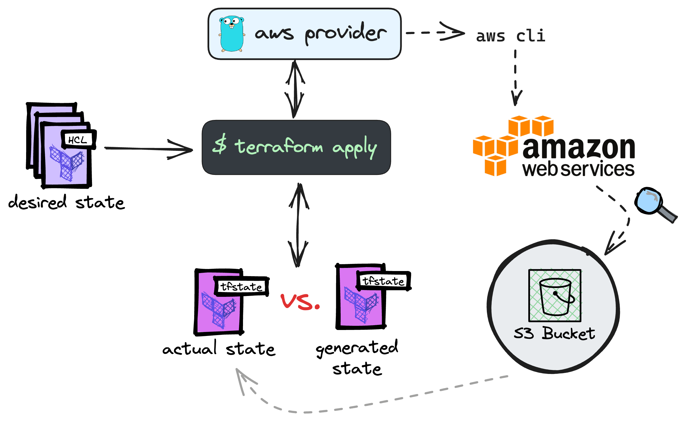
  </picture>
</p>

Let's say you change your bucket's tags and run `terraform apply`, for example.

```
# main.tf

# ...

resource "aws_s3_bucket" "my_bucket" {
  bucket = "my-unique-bucket-name-layerform"

  tags = {
    Name        = "Look I changed something"
  }
}
```

When you do that, Terraform will compare the new _desired_ state with the _actual_ state in `terraform.tfstate`. Then, it will see that the `tags` and `tags_all` properties are different and tell you it plans to update these fields.

```
Terraform used the selected providers to generate the following execution plan. Resource actions are indicated with the following symbols:
  ~ update in-place

Terraform will perform the following actions:

  # aws_s3_bucket.my_bucket will be updated in-place
  ~ resource "aws_s3_bucket" "my_bucket" {
        id                          = "my-unique-bucket-name-layerform"
      ~ tags                        = {
          ~ "Name" = "foo" -> "Look I changed something"
        }
      ~ tags_all                    = {
          ~ "Name" = "foo" -> "Look I changed something"
        }
        # (10 unchanged attributes hidden)

        # (3 unchanged blocks hidden)
    }
```

After confirming the `apply`, the `terraform.tfstate` file will now contain the updated tags.

```jsonc
{
  "version": 4,
  "terraform_version": "1.5.5",
  // ...
  "resources": [
    {
      "mode": "managed",
      "type": "aws_s3_bucket",
      "name": "my_bucket",
      "provider": "provider[\"registry.terraform.io/hashicorp/aws\"]",
      "instances": [
        {
          "schema_version": 0,
          "attributes": {
            // ...
            "tags": {
              "Name": "Look I changed something"
            },
            "tags_all": {
              "Name": "Look I changed something"
            },
            // ...
        }
      ]
    }
  ],
  "check_results": null
}
```

Note that `.tfstate` files are the only way for Terraform to know which resources exist. If you delete your `.tfstate` file and run `terraform apply`, Terraform will try to create your bucket again. If you proceed with the `apply`, it will throw an error because the bucket already exists.

```
Error: creating Amazon S3 (Simple Storage) Bucket (my-unique-bucket-name-layerform): bucket already exists

   with aws_s3_bucket.my_bucket,
   on main.tf line 7, in resource "aws_s3_bucket" "my_bucket":
    7: resource "aws_s3_bucket" "my_bucket" {
```

## Manipulating state to create multiple buckets

Let's say a developer called Aaron wants to have his own bucket for testing purposes. For that, Aaron needs to duplicate the `aws_s3_bucket` resource and run `terraform apply` again.

```hcl
# main.tf

# ...

resource "aws_s3_bucket" "my_bucket" {
  bucket = "my-unique-bucket-name-layerform"
}

resource "aws_s3_bucket" "aarons_bucket" {
  bucket = "aarons-unique-bucket-layerform"
}
```

The problem with this approach is that developers must duplicate resources to get their own instances of resources.

This problem compounds as you add resources that depend on one another.

For example, if these S3 buckets must contain an object, Aaron needs to duplicate the `aws_s3_bucket` _and_ the `aws_s3_object` within.

```hcl
# main.tf

resource "aws_s3_bucket" "my_bucket" {
  bucket = "my-unique-bucket-name-layerform"
}

resource "aws_s3_object" "my_configs" {
  bucket  = "my-unique-bucket-name-layerform"
  key     = "configs/.keep"
  content = "some configs"
}

resource "aws_s3_bucket" "my_bucket" {
  bucket = "aarons-unique-bucket-layerform"
}

resource "aws_s3_object" "my_configs" {
  bucket  = "aarons-unique-bucket-layerform"
  key     = "configs/.keep"
  content = "some configs"
}
```

As you can see, duplication quickly becomes unmanageable and error-prone.

Even if you use [modules](https://developer.hashicorp.com/terraform/language/modules), there's only so much you can do until you're duplicating the module declarations themselves.

You could also try using [the `count`](https://developer.hashicorp.com/terraform/language/meta-arguments/count) and [`for_each`](https://developer.hashicorp.com/terraform/language/meta-arguments/for_each) meta-arguments, but there's only so much you can do until complexity hits you in the head. And let's be honest, if something is called a _"meta-argument"_, it's probably not a good idea.

To avoid duplication, Aaron could tell Terraform to use his own empty `.tfstate` file when running `terraform apply`.

```
$ terraform apply -state="aaron.tfstate"
```

The problem with just using a new `.tfstate` file is that it will cause Terraform to throw an error because there's already a bucket whose name is `my-unique-bucket-name-layerform`.

<p align="center">
  <picture>
    <source media="(prefers-color-scheme: dark)" srcset="./img/terraform-states/duplicate-bucket-dark.png">
    <source media="(prefers-color-scheme: light)" srcset="./img/terraform-states/duplicate-bucket.png">
    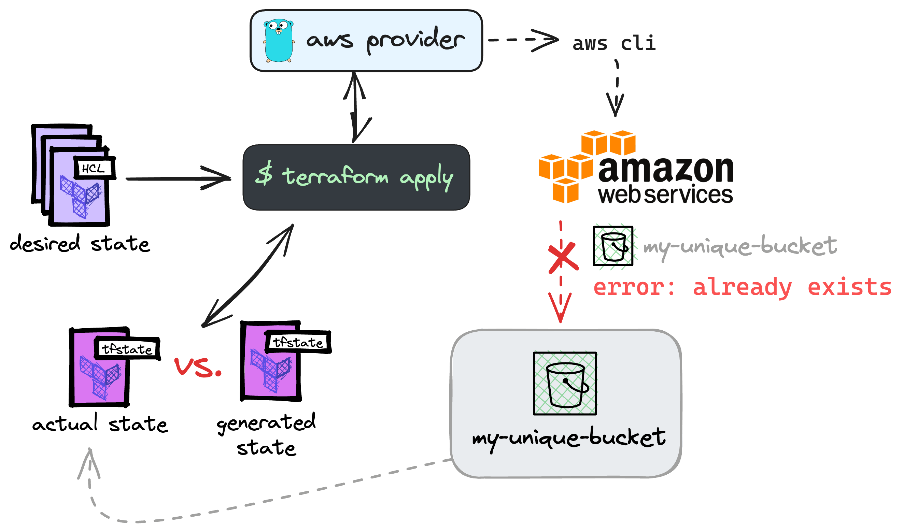
  </picture>
</p>

To avoid conflicts, Aaron should create a `random_id` resource and use its random ID in the bucket's name.

```
# main.tf

# ...

resource "random_string" "prefix" {
  length  = 8
  upper   = false
  special = false
}

resource "aws_s3_bucket" "my_bucket" {
  bucket = "${random_string.prefix.id}-layerform-example"
}
```

Now, Aaron and his team can create as many buckets as they want by specifying a different `.tfstate` file every time. That way, everyone on the team can have their own buckets for testing and development purposes.

```hcl
$ terraform apply -state=aaron.tfstate
$ terraform apply -state=dalton.tfstate
$ terraform apply -state=pete.tfstate
$ terraform apply -state=nicolas.tfstate
```

This approach will work because each `.tfstate` file will be empty, causing Terraform to generate a new ID every time. Consequently, each bucket will have a different name, and there won't be conflicts.

<p align="center">
  <picture>
    <source media="(prefers-color-scheme: dark)" srcset="./img/terraform-states/new-state-dark.png">
    <source media="(prefers-color-scheme: light)" srcset="./img/terraform-states/new-state.png">
    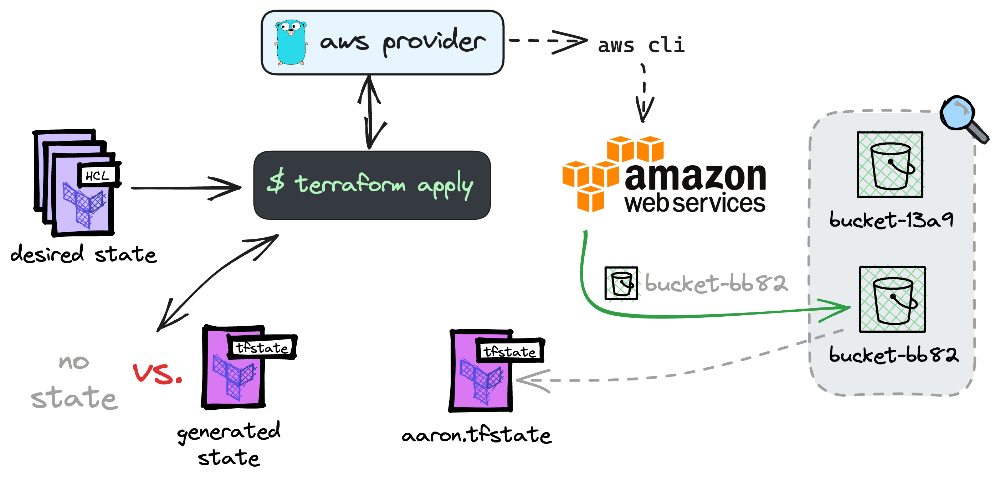
  </picture>
</p>

Besides the practical advantages of not having to modify `.tf` files every time someone needs a new bucket, this approach also completely detaches the concept of a _desired_ state with the concept of an _actual_ state.

In Terraform's design, a declaration of the _desired_ infrastructure is tied to a single _actual_ state. That's a bad abstraction. In the real world, various instances of the _desired_ infrastructure may exist. Consequently, having various _actual_ states should be possible, too — one for each infrastructure instance.

## Baking reusability into state files

Buckets are cheap. Consequently, it's okay for each person on Aaron's team to have their buckets.

Now, let's imagine Aaron's system ran on top of a Kubernetes cluster. At the time of this writing, a managed Kubernetes cluster on AWS costs $0.10, which amounts to $72 a month.

If Aaron, Dalton, Pete, and Nicolas all use brand new EKS clusters for their testing and development environments, that will cost their company $288 a month, and all clusters will be subutilized, especially if they're provisioning large EC2 instances.

<p align="center">
  <picture>
    <source media="(prefers-color-scheme: dark)" srcset="./img/terraform-states/expensive-subutilized-dark.png">
    <source media="(prefers-color-scheme: light)" srcset="./img/terraform-states/expensive-subutilized.png">
    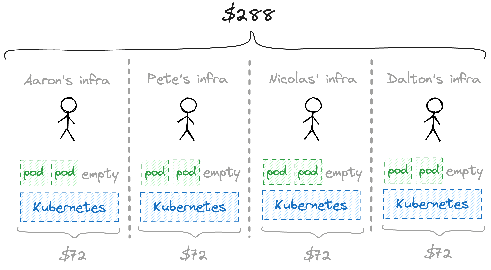
  </picture>
</p>

To save money, Aaron could share the Kubernetes cluster with his team and allow each colleague to deploy their testing pods to a new namespace. That way, they'd have a single cluster and pay only $72. Additionally, all pods could share the same EC2 instance, making it even cheaper to run these development environments.

<p align="center">
  <picture>
    <source media="(prefers-color-scheme: dark)" srcset="./img/terraform-states/cheaper-full-capacity-dark.png">
    <source media="(prefers-color-scheme: light)" srcset="./img/terraform-states/cheaper-full-capacity.png">
    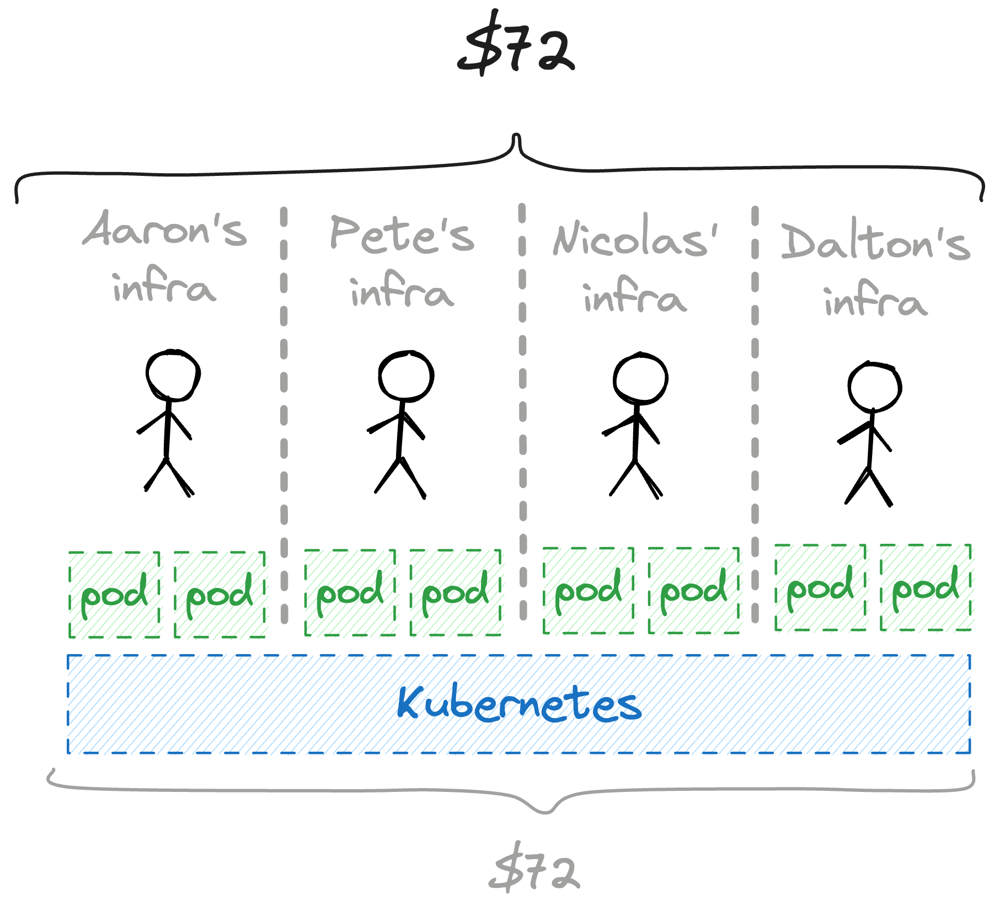
  </picture>
</p>

For that, Aaron's first step would be to create an `eks.tf` file and declare an EKS cluster (Amazon's managed Kubernetes offering).

```hcl
# eks.tf

module "eks" "shared_cluster" {
  source  = "terraform-aws-modules/eks/aws"
  cluster_name    = "dev-eks-base-layerform"

  # I have intentionally skipped the VPC and node groups
  # configurations to keep these examples short and sweet.
}
```

When Aaron applies this file using `terraform apply -state=base.tfstate`, Terraform will generate a `base.tfstate` file containing the cluster's data.

<p align="center">
  <picture>
    <source media="(prefers-color-scheme: dark)" srcset="./img/terraform-states/base-tfstate-kubernetes-dark.png">
    <source media="(prefers-color-scheme: light)" srcset="./img/terraform-states/base-tfstate-kubernetes.png">
    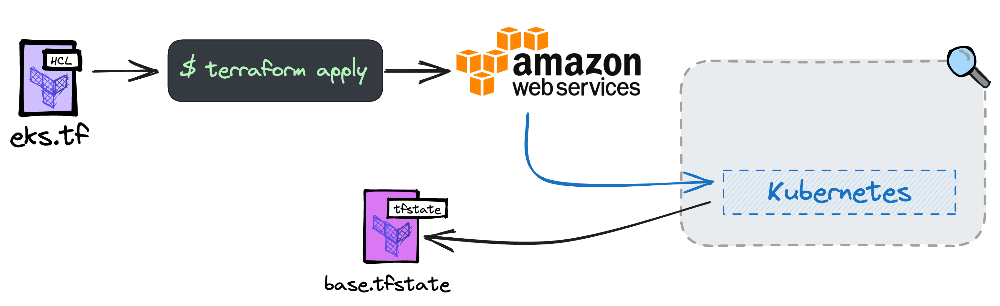
  </picture>
</p>

After that, Aaron will create a `pods.tf` file, which declares a namespace and pods within that namespace. To avoid conflicts, Aaron will use `random_id` to generate the namespace's name.

```
# pods.tf

resource "random_string" "namespace_suffix" {
  length  = 8
  special = false
}

resource "kubernetes_namespace" "user_ns" {
  metadata {
    name = "user-ns-${namespace_suffix}"
  }
}

resource "kubernetes_pod" "service_a" {
  metadata {
    name      = "service-a"
    namespace = kubernetes_namespace.user_ns.metadata[0].name
  }

  # ...
}

resource "kubernetes_pod" "service_b" {
  metadata {
    name      = "service-b"
    namespace = kubernetes_namespace.user_ns.metadata[0].name
  }

  # ...
}
```

Then, Aaron can take a snapshot of the old `base.tfstate` by copying it to `base-snapshot.tfstate`. Then, he can create his development pods using `terraform apply -state=base.tfstate`.

That way, Terraform will create his pods on top of the existing Kubernetes cluster without modifying `base-snapshot.tfstate`.

<p align="center">
  <picture>
    <source media="(prefers-color-scheme: dark)" srcset="./img/terraform-states/pods-snapshot-kubernetes-dark.png">
    <source media="(prefers-color-scheme: light)" srcset="./img/terraform-states/pods-snapshot-kubernetes.png">
    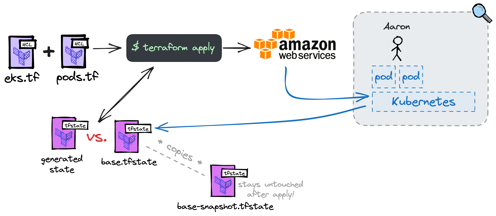
  </picture>
</p>

Now, let's say Dalton also needs his own development pods but doesn't want to spend another $72 (and an extra 20 minutes) to create a new cluster for himself.

For that, Dalton could ask Aaron for the `base-snapshot.tfstate` file. Then, he'd run `terraform apply -state=base-snapshot.tfstate` to create his own set of pods within a new namespace in the same cluster.

<p align="center">
  <picture>
    <source media="(prefers-color-scheme: dark)" srcset="./img/terraform-states/dalton-pods-snapshot-kubernetes-dark.png">
    <source media="(prefers-color-scheme: light)" srcset="./img/terraform-states/dalton-pods-snapshot-kubernetes.png">
    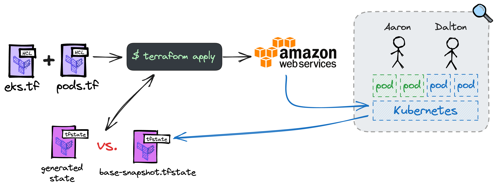
  </picture>
</p>

Pete and Nicolas could do the same. All they need to create their development pods in the same cluster is to ask Aaron for the `base-snapshot.tfstate` and use it when running `terraform apply`.

<p align="center">
  <picture>
    <source media="(prefers-color-scheme: dark)" srcset="./img/terraform-states/all-pods-snapshot-kubernetes-dark.png">
    <source media="(prefers-color-scheme: light)" srcset="./img/terraform-states/all-pods-snapshot-kubernetes.png">
    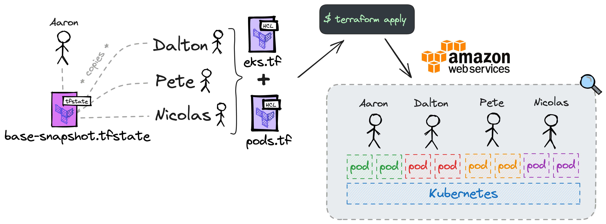
  </picture>
</p>

## The problem with sharing state snapshots

The problem with sharing state snapshots is that they must be kept up-to-date across all machines. What happens if Nicolas wants to change the cluster's name and write it in French, for example?

In that case, he'd have to apply the change and send the new `.tfstate` file to Aaron, Dalton, and Pete to download. Otherwise, their `terraform apply` runs would start failing.

Also, managing these files would become increasingly complicated if they share a `kafka` instance within the cluster. In that case, everyone in Aaron's team would have to have a `base-snapshot.tfstate` _and_ a `kafka-snapshot.tfstate` that they need to merge into a single file before running `terraform apply`.

Layerform solves that problem by encapsulating your Terraform files into what we call _layer definitions_.

In Aaron's case, if he were to use Layerform, he'd create one layer definition referencing his `eks.tf` file and another referencing `pods.tf`. These would be the `eks` and the `pods` layers, respectively.

For the `pods` layer definition, Aaron would say it depends on an instance of the `eks` layer.

<p align="center">
  <picture>
    <source media="(prefers-color-scheme: dark)" srcset="./img/terraform-states/layer-definitions-dark.png">
    <source media="(prefers-color-scheme: light)" srcset="./img/terraform-states/layer-definitions.png">
    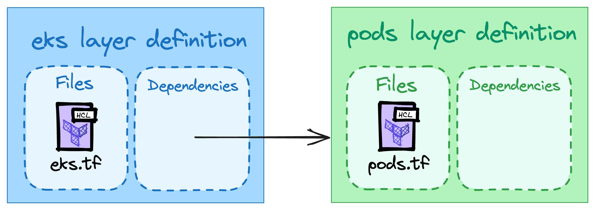
  </picture>
</p>

Then, when running `layerform spawn eks`, Layerform would run the `eks.tf` file and associate the resulting `.tfstate` to the ID `default`.

<p align="center">
  <picture>
    <source media="(prefers-color-scheme: dark)" srcset="./img/terraform-states/layer-eks-tfstate-dark.png">
    <source media="(prefers-color-scheme: light)" srcset="./img/terraform-states/layer-eks-tfstate.png">
    
  </picture>
</p>

After that, if Pete runs `layerform spawn pods`, Layerform will pull the `state` for the `default` instance of `eks`. Then, it will merge the `eks.tf` and `pods.tf` files and apply them using that base state.

<p align="center">
  <picture>
    <source media="(prefers-color-scheme: dark)" srcset="./img/terraform-states/layer-pods-tfstate-dark.png">
    <source media="(prefers-color-scheme: light)" srcset="./img/terraform-states/layer-pods-tfstate.png">
    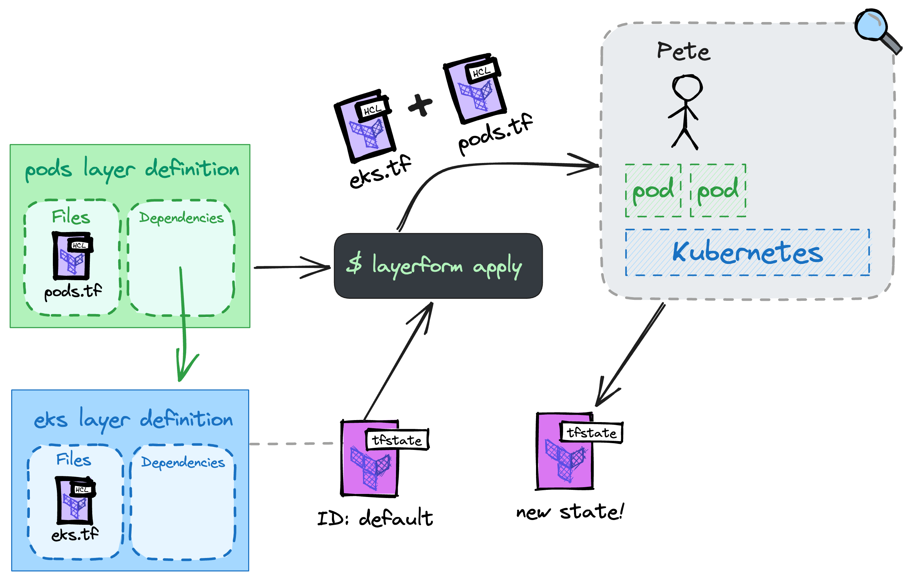
  </picture>
</p>

Dalton and Nicolas could do the same. When they run `layerform spawn pods`, Layerform will look for the `default` state for `eks` and spin their layer instances on top of it.

<p align="center">
  <picture>
    <source media="(prefers-color-scheme: dark)" srcset="./img/terraform-states/everyone-pods-tfstate-dark.png">
    <source media="(prefers-color-scheme: light)" srcset="./img/terraform-states/everyone-pods-tfstate.png">
    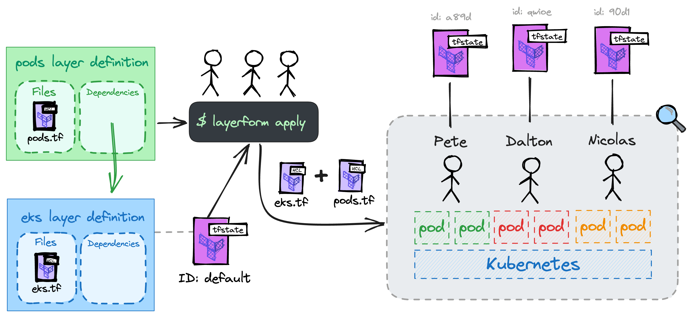
  </picture>
</p>

## Storing state snapshots

Similarly to Terraform, Layerform can use a cloud back-end to store the states for the different instances and associate them with their IDs.

The difference between Layerform and Terraform is that Layerform can pick and merge the different states based on their IDs.

<p align="center">
  <picture>
    <source media="(prefers-color-scheme: dark)" srcset="./img/terraform-states/components-backend-dark.png">
    <source media="(prefers-color-scheme: light)" srcset="./img/terraform-states/components-backend.png">
    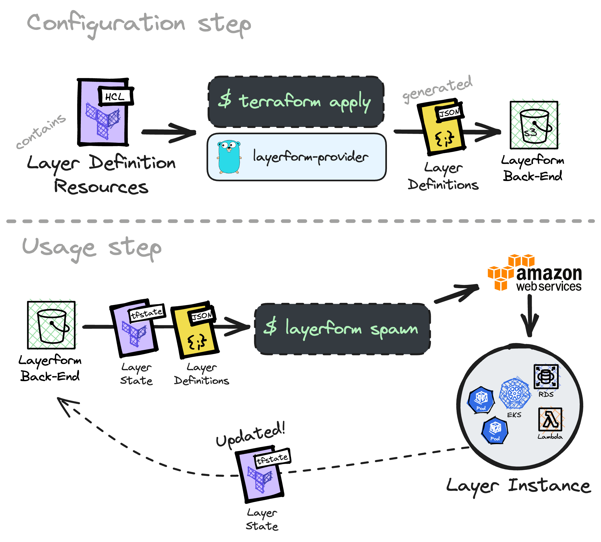
  </picture>
</p>

## Other things you can do with layers

By breaking down your infrastructure into layers, you can have each team care for a particular part of the infrastructure.

For example, the platform team could put together the configurations for a Kubernetes cluster and Kafka instance.

The other teams could then build their layers on top of the platform team's. That way, each team takes care of its own infra and may spin up multiple instances of it without relying on numerous "matching strings" coming from [Terraform's data sources](https://developer.hashicorp.com/terraform/language/data-sources).

<p align="center">
  <picture>
    <source media="(prefers-color-scheme: dark)" srcset="./img/terraform-states/team-responsibilities-dark.png">
    <source media="(prefers-color-scheme: light)" srcset="./img/terraform-states/team-responsibilities.png">
    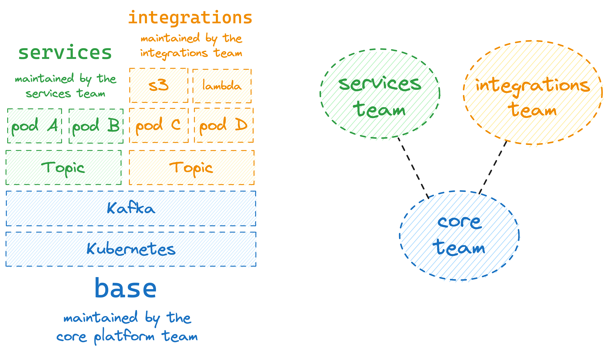
  </picture>
</p>

Besides encapsulation, layers are also helpful for cost control and chargebacks. By breaking down your infrastructure into layers, Layerform can automatically tag resources in each layer instance so you know which teams' layers spend the most.

## Summarising layers

At the end of the day, we can summarise Layerform as an intelligent way to break down _desired_ states and dissociate them from _actual_ states. That way, multiple _actual_ states can exist for a particular _desired_ state definition.

In a way, layers and their instances are like classes and objects. The terraform files for each layer are a "class," and each instance is an "object" with that class' properties.

## Questions?

If you've got questions, feel free to use [this repository's issue tracker](https://github.com/ergomake/layerform/issues) or [book a few minutes with me](https://calendly.com/lucasfcosta/ergomake-15-minutes).

**If this post has been helpful, please consider [starring the repo](https://github.com/ergomake/layerform)** or sharing it on HackerNews and Reddit.
